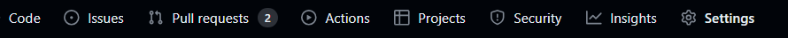
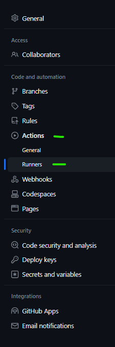

# Checkmarx CxFlow Github Action  

[](https://www.gnu.org/licenses)
[](https://github.com/checkmarx-ts/checkmarx-github-action/releases)
[](https://github.com/checkmarx-ts/checkmarx-github-action/issues)

Checkmarx CxFlow GitHub Action with SARIF output.  

Publish Security Alerts associated with the code in your Github Repository using Checkmarx with this Github Action Integration. 

This is a Wrapper to trigger scans the latest version of CxFlow through Docker to launch Checkmarx SAST or SCA Scans.


* Checkmarx SAST (**CxSAST**) is an enterprise-grade flexible and accurate static analysis solution used to identify hundreds of security vulnerabilities in custom code. It is used by development, DevOps, and security teams to scan source code early in the SDLC, identify vulnerabilities and provide actionable insights to remediate them. 
* Checkmarx SCA (**CxSCA**) is an effective next-gen software composition analysis solution designed to help development teams ship secure software quickly while giving AppSec teams the insight and control they need to improve your software security risk posture.
* Checkmarx Flow (**CxFlow**) is an SDLC orchestration module managing Applciaton Security Test (AST) scan initiation and results manangement.

Please find more info in the official website: <a href="www.checkmarx.com">Checkmarx.com</a>

## Version Compatiblity

The GitHub action  [](https://github.com/checkmarx-ts/checkmarx-github-action/releases)  is only compatible with Checkmarx SAST 9.x and Checkmarx CxSCA.

*Note:* Please use [cx-flow-debian](https://github.com/checkmarx-ts/checkmarx-cxflow-github-debian) GitHub action for using cx-flow with the Debian operating system. This GitHub action supports Alpine OS. Every parameter is the same in both. 

## Inputs

| Variable                | Example Value &nbsp;                           | Description &nbsp;                                                                                                                                                                                                                                                 | Type          | Required | Default                        |
|-------------------------|------------------------------------------------|--------------------------------------------------------------------------------------------------------------------------------------------------------------------------------------------------------------------------------------------------------------------|---------------|----------|--------------------------------|
| checkmarx_url           | https://checkmarx.company.com                  | Checkmarx Server URL                                                                                                                                                                                                                                               | String        | Yes      | N/A                            |
| checkmarx_username      | ${{ secrets.CHECKMARX_USERNAME }}              | Checkmarx Username                                                                                                                                                                                                                                                 | String        | Yes      | N/A                            |
| checkmarx_password      | ${{ secrets.CHECKMARX_PASSWORD }}              | Checkmarx Password                                                                                                                                                                                                                                                 | Secure String | Yes      | N/A                            |
| checkmarx_client_secret | ${{ secrets.CHECKMARX_CLIENT_SECRET }}         | Checkmarx OIDC Client Secret  Reference [1](https://checkmarx.atlassian.net/wiki/spaces/KC/pages/1187774721/Using+the+CxSAST+REST+API+v8.6.0+and+up), [2](https://checkmarx.atlassian.net/wiki/spaces/KC/pages/1187774721/Using+the+CxSAST+REST+API+v8.6.0+and+up) | Secure String | Yes      |                                |
| team                    | /CxServer/SP/Company                           | Checkmarx Team for Project                                                                                                                                                                                                                                         | String        | No       | /CxServer/SP/Company           |
| project                 | ProjectName                                    | Checkmarx Project                                                                                                                                                                                                                                                  | String        | Yes      | N/A                            |
| app                     | AppID-1234                                     | Unique Application Identifier used by downstream bug trackers (i.e. Jira)                                                                                                                                                                                          | String        | No       | SampleApp                      |
| preset                  | Checkmarx Express                              | Checkmarx scan preset (SAST)                                                                                                                                                                                                                                       | String        | No       | High and Medium                |
| break_build             | true                                           | Break build based on results?                                                                                                                                                                                                                                      | Boolean       | No       | false                          |
| bug_tracker             | Sarif, GitHubPull, GitHub                      | Bug-tracker used for scan results                                                                                                                                                                                                                                  | String        | No       | Sarif                          |
| incremental             | true                                           | Trigger scan as incremental? (SAST)                                                                                                                                                                                                                                | Boolean       | No       | true                           |
| github_token            | ${{ secrets.GITHUB_TOKEN }}                    | GitHub API Token, used for PR Feedback or GitHub Issue Feedback                                                                                                                                                                                                    | String        | No       | ${{ github.token }}            |
| repo-url                | ${{ github.event.repository.url }}             | GitHub Repository URL, used for Issue Feedback                                                                                                                                                                                                                     | String        | Yes      | NA                             |
| scanners                | sast, cxgo, sca                                | Vulnerability Scanners (sast, sca, cxgo). Multiple comma seperated values allowed.                                                                                                                                                                                 | String        | Yes      | None                           |
| extra_certificates      | certificates                                   | Workspace subdirectory containing additional CxFlow X509 certificates (.crt)                                                                                                                                                                                       | String        | No       | None                           |
| sca_api_url             | https://api-sca.checkmarx.net                  | API URL for SCA scan                                                                                                                                                                                                                                               | String        | No       | https://api-sca.checkmarx.net  |
| sca_app_url             | https://sca.checkmarx.net                      | APP URL for SCA scan                                                                                                                                                                                                                                               | String        | No       | https://sca.checkmarx.net      |
| sca_access_control_url  | https://platform.checkmarx.net                 | Access control URL for SCA scan                                                                                                                                                                                                                                    | String        | No       | https://platform.checkmarx.net |
| sca_tenant              | SCA-COMPANY_NAME                               | Tenant for the SCA project                                                                                                                                                                                                                                         | String        | No       | N/A                            |
| sca_username            | ${{ secrets.SCA_USERNAME }}                    | Username for SCA scan                                                                                                                                                                                                                                              | String        | No       | N/A                            |
| sca_password            | ${{ secrets.SCA_PASSWORD }}                    | Password for SCA scan                                                                                                                                                                                                                                              | Secure String | No       | N/A                            |
| cxgo_base_url           | https://api.checkmarx.net                      | Base URL for CxGo Scan                                                                                                                                                                                                                                             | String        | No       | https://api.checkmarx.net      |
| cxgo_portal_url         | https://cloud.checkmarx.net                    | Portal URL for CxGo Scan                                                                                                                                                                                                                                           | String        | No       | https://cloud.checkmarx.net    |
| cxgo_client_secret      | ${{ secrets.CXGO_CLIENT_SECRET }}              | CxGo Client secret                                                                                                                                                                                                                                                 | Secure String | No       | N/A                            |
| jira_url                | ${{ secrets.JIRA_URL }}                        | Jira Url                                                                                                                                                                                                                                                           | Secure String | No       | N/A                            | 
| jira_username           | ${{ secrets.JIRA_USERNAME }}                   | Jira Username                                                                                                                                                                                                                                                      | Secure String | No       | N/A                            |
| jira_token              | ${{ secrets.JIRA_TOKEN }}                      | Jira Secret. This is personal access token, not password.                                                                                                                                                                                                          | Secure String | No       | N/A                            |
| jira_project            | ${{ secrets.JIRA_PROJECT }}                    | Jira Project Name                                                                                                                                                                                                                                                  | Secure String | No       | N/A                            |
| jira_issue_type         | 'Application Security Bug'                     | Jira Issue Type                                                                                                                                                                                                                                                    | String        | No       | N/A                            |
| jira_open_transition    | 'In Progress'                                  | Jira Open Transition Status                                                                                                                                                                                                                                        | String        | No       | N/A                            |
| jira_close_transition   | 'Done'                                         | Jira Close Transition Status                                                                                                                                                                                                                                       | String        | No       | N/A                            |
| jira_open_status        | 'Backlog,Selected for Development,In Progress' | Jira Open Status                                                                                                                                                                                                                                                   | String        | No       | N/A                            |
| jira_closed_status      | 'Done'                                         | Jira Closed Status                                                                                                                                                                                                                                                 | String        | No       | N/A                            |
| params                  | --severity=High --branch=${{ github.ref }}     | Any additional parameters for CxFlow.  For a full list of all the parameters, see the [following](https://github.com/checkmarx-ltd/cx-flow/wiki/Configuration).  Special note about [filtering](#Filters)                                                          | String        | No       | N/A                            |
| java_opts               | -Xms512m                                       | Any Java options                                                                                                                                                                                                                                                   | String        | No       | N/A                            |

## Secrets

_Note: It is recommended to leverage secrets for any sensitive inputs_
* checkmarx_url: ${{ secrets.CHECKMARX_URL }}
* checkmarx_username: ${{ secrets.CHECKMARX_USERNAME }}
* checkmarx_password: ${{ secrets.CHECKMARX_PASSWORD }}
* checkmarx_client_secret: ${{ secrets.CHECKMARX_CLIENT_SECRET }}
* github_token: ${{ secrets.GITHUB_TOKEN }}
* sca_username: ${{ secrets.SCA_USERNAME }}
* sca_password: ${{ secrets.SCA_PASSWORD }}
* cxgo_client_secret: ${{ secrets.CXGO_CLIENT_SECRET }}
* jira_url: ${{ secrets.JIRA_URL }}
* jira_username: ${{ secrets.JIRA_USERNAME }}
* jira_token: ${{ secrets.JIRA_TOKEN }}
* jira_project: ${{ secrets.JIRA_PROJECT }}


## Filters

Files can be excluded from the zipfile that CxFlow uploads to CxSAST by adding the `--cx-flow.zip-exclude` command line option to the `params` property in the GitHub Action configuration. The value of this option is a comma-separated list of regular expressions. Any file whose full path is matched by one of these regular expressions will be excluded from the zipfile.

The regular expression syntax is that used by the [`java.util.regex.Pattern`](https://docs.oracle.com/javase/8/docs/api/java/util/regex/Pattern.html) class.

Here is an example of filtering files:

```
--cx-flow.zip-exclude=\.git/.*,\.github/.*,apps/tests/.*,apps/docs/.*,apps/web/.*
```

This will exclude all files and subdirectories found under the `.git`, `.github`, `apps/tests`, `apps/docs`, and `apps/web` directories.

* Excluding the `.git` and `.github` folders from the zip file is highly important! Otherwise each commit will trigger a full scan due to changes in the files under these directories (which do not contain files that CxSAST will scan anyway).
* Do not enclose the list of regular expressions in quotes as these will be taken to be part of the regular expression(s).

The CxFlow log will show you the regular expressions used:

```
2023-01-25 03:14:45.232  INFO 8 --- [           main] c.c.f.u.ZipUtils                          [vLhiqdlb] : Applying exclusions: \.git/.*,\\.github/.*
```

If DEBUG logging is enabled, each matching file will be logged:

```
2023-01-25 03:14:45.240 DEBUG 8 --- [           main] c.c.f.u.ZipUtils                          [vLhiqdlb] : match: \.git/.*$1.git/HEAD
2023-01-25 03:14:45.240 DEBUG 8 --- [           main] c.c.f.u.ZipUtils                          [vLhiqdlb] : match: \.git/.*$1.git/index
2023-01-25 03:14:45.241 DEBUG 8 --- [           main] c.c.f.u.ZipUtils                          [vLhiqdlb] : match: \.git/.*$1.git/config
...
```

## Params
#### Example for params
Any remaining cx-flow parameters can be provided to params in the same way that they are passed in cli mode. To understand more about cli parameters, Please see [following](https://github.com/checkmarx-ltd/cx-flow/wiki/Configuration#cli)

For a full list of all the cx-flow parameters, see the [following](https://github.com/checkmarx-ltd/cx-flow/wiki/Configuration)
````yaml
# sample examples
    --sca.team ="/CxServer/Sca
    --jira.url ="https://xxxx.atlassian.net"
````
*Note:* Please use environment variables if any params values contain spaces.
#### Example for environment variable
```yaml
jobs:
  # This workflow contains a single job called "build"
  build:
    name: CHECKMARX
    # The type of runner that the job will run on - Ubuntu is required as Docker is leveraged for the action
    permissions:
      contents: read # for actions/checkout to fetch code
      issues: write # for checkmarx-ts/checkmarx-cxflow-github-action to write feedback to github issues
      pull-requests: write # for checkmarx-ts/checkmarx-cxflow-github-action to write feedback to PR
      security-events: write # for github/codeql-action/upload-sarif to upload SARIF results
    runs-on: ubuntu-latest

    # Steps require - checkout code, run CxFlow Action, Upload SARIF report (optional)
    steps:
    # Checks-out your repository under $GITHUB_WORKSPACE, so your job can access it
    - uses: actions/checkout@v2
    # Runs the Checkmarx Scan leveraging the latest version of CxFlow - REFER to Action README for list of inputs
    - name: Checkmarx CxFlow Action
      uses: checkmarx-ts/checkmarx-cxflow-github-action@v1.9
      #environment variable used for cx-flow
      env:
        JIRA_FIELDS_0_JIRA_DEFAULT_VALUE : APPSEC-2371
        JIRA_FIELDS_0_JIRA_FIELD_NAME : "Epic Link"
        JIRA_FIELDS_0_JIRA_FIELD_TYPE : text
        JIRA_FIELDS_0_TYPE : static
      with:
        project: ${{ github.repository }}-PR
        team: ${{ secrets.CHECKMARX_TEAMS }}
        checkmarx_url: ${{ secrets.CHECKMARX_URL }}
        checkmarx_username: ${{ secrets.CHECKMARX_USERNAME }}
        checkmarx_password: ${{ secrets.CHECKMARX_PASSWORD }}
        checkmarx_client_secret: ${{ secrets.CHECKMARX_CLIENT_SECRET }}
        scanners: sca
        break_build: true
        bug_tracker: jira
        sca_api_url: ${{ secrets.SCA_API_URL }}
        sca_app_url: ${{ secrets.SCA_APP_URL }}
        sca_access_control_url: ${{ secrets.SCA_ACCESS_CONTROL_URL }}
        sca_tenant: ${{  secrets.SCA_TENANT }}
        sca_username: ${{ secrets.SCA_USERNAME }}
        sca_password: ${{ secrets.SCA_PASSWORD }}
        jira_url : ${{ secrets.JIRA_URL }}
        jira_username : ${{ secrets.JIRA_USERNAME }}
        jira_token : ${{ secrets.JIRA_TOKEN }}
        jira_project : ${{ secrets.JIRA_PROJECT }}
        jira_issue_type : 'Bug'
        jira_open_transition : 'In Progress'
        jira_close_transition : 'Done'
        jira_open_status : 'Selected for Development,In Progress'
        jira_closed_status : 'Done'
        params: '--namespace=${{ github.repository_owner }} --repo-name=${{ github.event.repository.name }} --branch=${{ github.ref }} --merge-id=${{ github.event.number }} --logging.level.com.checkmarx.*=DEBUG --cx-flow.filterSeverity --cx-flow.filterCategory'
``` 
In given example as "Epic Link" contains space, hence it is used as environment variable and not passed in params.

In the environment variable format, each parameter is represented by a unique variable name. The variable names are constructed by converting the YAML path to uppercase and replacing any dots with underscores The square brackets and their index are removed. The parameter key is separated from the value by an equal sign

In the given example, the YAML parameter is transformed to the equivalent environment variable format. Each line represents a separate environment variable with its respective key-value pair.

To understand more about environment variable, Please see [following](https://github.com/checkmarx-ltd/cx-flow/wiki/Configuration#env)
## Outputs

The default output format for this GitHub Action is a [SARIF](https://docs.github.com/en/github/finding-security-vulnerabilities-and-errors-in-your-code/sarif-support-for-code-scanning) output report stored in the working directory as **./cx.sarif**

For full documentation on all the supported output formats and defect management integration, please see the [following](https://github.com/checkmarx-ltd/cx-flow/wiki/Bug-Trackers-and-Feedback-Channels).  

### `SARIF Report`

The file **_./cx.sarif_** is created containing issue details based on the filtering policy of CxFlow.  To make use of the report for CodeQL please make sure the [following is considered](https://docs.github.com/en/github/finding-security-vulnerabilities-and-errors-in-your-code/uploading-a-sarif-file-to-github).  See sample useage below.

## Example usage

```
    # Steps represent a sequence of tasks that will be executed as part of the job
    steps:
    # Checks-out your repository under $GITHUB_WORKSPACE, so your job can access it
    - uses: actions/checkout@v2
    # Scan code with Checkmarx
    - name: Checkmarx CxFlow Action
      uses: checkmarx-ts/checkmarx-cxflow-github-action@v1.3
      with:
        project: GithubActionTest
        team: /CxServer/SP/Checkmarx
        checkmarx_url: ${{ secrets.CHECKMARX_URL }}
        checkmarx_username: ${{ secrets.CHECKMARX_USERNAME }}
        checkmarx_password: ${{ secrets.CHECKMARX_PASSWORD }}
        checkmarx_client_secret: ${{ secrets.CHECKMARX_CLIENT_SECRET }}
    # Upload SARIF report for CodeQL / Security Alerts PRocessing
    - name: Upload SARIF file
      uses: github/codeql-action/upload-sarif@v2
      with:
        sarif_file: cx.sarif
```

## Sample Output (Security Alerts)


## Sample Workflow files

 * [Github PUSH workflow for SAST](sample-yml/checkmarx-sast-scan-push.yml)
 * [Github PUSH workflow for SCA](sample-yml/checkmarx-sca-scan-push.yml)
 * [Github PULL REQUEST workflow for SAST](sample-yml/github-pullrequest.yml)
 * [Github Cloud Local scan](sample-yml/cloud_runner_local_scan.yml)
 * [Github Cloud Remote scan](sample-yml/remote_sample.yml)

## Checkmarx SAST/SCA using self-hosted  environment

### How to setup GitHub self hosted runner?
#### User can follow below steps to configure self-hosted runner-
#### 1- Go to settings of your project 

#### 2- Select Runners under Actions tab 

#### 3- Select new self-hosted runner 
 
#### 4- Please select OS same as your target machine and follow instruction 


### GitHub Action Self-hosted runner  configuration for  Local Scan
```
# This workflow uses actions that are not certified by GitHub.
# They are provided by a third-party and are governed by
# separate terms of service, privacy policy, and support
# documentation.

# This is a basic workflow to help you get started with Using Checkmarx CxFlow Action

name: CxFlow

on:
  push:
    branches: [ $default-branch, $protected-branches ]
  pull_request:
    # The branches below must be a subset of the branches above
    branches: [ $default-branch ]
  schedule:
    - cron: $cron-weekly

# A workflow run is made up of one or more jobs that can run sequentially or in parallel - this job is specifically configured to use the Checkmarx CxFlow Action
permissions:
  contents: read

jobs:
  # This workflow contains a single job called "build"
  build:
    # The type of runner that the job will run on - Ubuntu is required as Docker is leveraged for the action
    permissions:
      contents: read # for actions/checkout to fetch code
      issues: write # for checkmarx-ts/checkmarx-cxflow-github-action to write feedback to github issues
      pull-requests: write # for checkmarx-ts/checkmarx-cxflow-github-action to write feedback to PR
      security-events: write # for github/codeql-action/upload-sarif to upload SARIF results
      actions: read # only required for a private repository by github/codeql-action/upload-sarif to get the Action run status
    runs-on: self-hosted

    # Steps require - checkout code, run CxFlow Action, Upload SARIF report (optional)
    steps:
    # Checks-out your repository under $GITHUB_WORKSPACE, so your job can access it
    - uses: actions/checkout@v3
    # Runs the Checkmarx Scan leveraging the latest version of CxFlow - REFER to Action README for list of inputs
    - name: Checkmarx CxFlow Action
      uses: checkmarx-ts/checkmarx-cxflow-github-action@v1.9
      with:
        project: ${{ secrets.CHECKMARX_PROJECT }}
        team: ${{ secrets.CHECKMARX_TEAMS }}
        checkmarx_url: ${{ secrets.CHECKMARX_URL }}
        checkmarx_username: ${{ secrets.CHECKMARX_USERNAME }}
        checkmarx_password: ${{ secrets.CHECKMARX_PASSWORD }}
        checkmarx_client_secret: ${{ secrets.CHECKMARX_CLIENT_SECRET }}
        scanners: sast
        params: --namespace=${{ github.repository_owner }} --checkmarx.settings-override=true --repo-name=${{ github.event.repository.name }} --branch=${{ github.ref_name }} --cx-flow.filter-severity --cx-flow.filter-category --checkmarx.disable-clubbing=true --repo-url=${{ github.event.repository.url }}
    # Upload the Report for CodeQL/Security Alerts
    - name: Upload SARIF file
      uses: github/codeql-action/upload-sarif@v2
      with:
        sarif_file: cx.sarif

```
#### Note : Please check in the logs your working directory should be same as the location where code checked out on local machine.

### GitHub Action Self-hosted runner configuration for Remote Scan
```
 # This workflow uses actions that are not certified by GitHub.
# They are provided by a third-party and are governed by
# separate terms of service, privacy policy, and support
# documentation.

# This is a basic workflow to help you get started with Using Checkmarx CxFlow Action

name: CxFlow

on:
  push:
    branches: [ $default-branch, $protected-branches ]
  pull_request:
    # The branches below must be a subset of the branches above
    branches: [ $default-branch ]
  schedule:
    - cron: $cron-weekly

# A workflow run is made up of one or more jobs that can run sequentially or in parallel - this job is specifically configured to use the Checkmarx CxFlow Action
permissions:
  contents: read

jobs:
  # This workflow contains a single job called "build"
  build:
    # The type of runner that the job will run on - Ubuntu is required as Docker is leveraged for the action
    permissions:
      contents: read # for actions/checkout to fetch code
      issues: write # for checkmarx-ts/checkmarx-cxflow-github-action to write feedback to github issues
      pull-requests: write # for checkmarx-ts/checkmarx-cxflow-github-action to write feedback to PR
      security-events: write # for github/codeql-action/upload-sarif to upload SARIF results
      actions: read # only required for a private repository by github/codeql-action/upload-sarif to get the Action run status
    runs-on: self-hosted

    # Steps require - checkout code, run CxFlow Action, Upload SARIF report (optional)
    steps:
      # Checks-out your repository under $GITHUB_WORKSPACE, so your job can access it
      - uses: actions/checkout@v3
      # Runs the Checkmarx Scan leveraging the latest version of CxFlow - REFER to Action README for list of inputs
      - name: Checkmarx CxFlow Action
        uses: checkmarx-ts/checkmarx-cxflow-github-action@v1.9
        with:
          project: ${{ secrets.CHECKMARX_PROJECT }}
          team: ${{ secrets.CHECKMARX_TEAMS }}
          checkmarx_url: ${{ secrets.CHECKMARX_URL }}
          checkmarx_username: ${{ secrets.CHECKMARX_USERNAME }}
          checkmarx_password: ${{ secrets.CHECKMARX_PASSWORD }}
          checkmarx_client_secret: ${{ secrets.CHECKMARX_CLIENT_SECRET }}
          scanners: sast
          params: --github --namespace=${{ github.repository_owner }} --checkmarx.settings-override=true --repo-name=${{ github.event.repository.name }} --branch=${{ github.ref_name }} --cx-flow.filter-severity --cx-flow.filter-category --checkmarx.disable-clubbing=true --repo-url=${{ github.event.repository.url }}
      # Upload the Report for CodeQL/Security Alerts
      - name: Upload SARIF file
        uses: github/codeql-action/upload-sarif@v2
        with:
          sarif_file: cx.sarif
```


## FAQ
#### Why change in single file causing issue in SAST there is more than 7% files code change
* This issue occurs due to not exclusion of .git and .github folders. Please refer below code 
```
env:
        CHECKMARX_CLIENT_ID : "resource_owner_sast_client"
        CHECKMARX_SCOPE : "access_control_api sast_api"
        CX_FLOW_ZIP_EXCLUDE : "\\.git/.*, \\.github/.*"
```

## How To Contribute

We welcome [issues](https://github.com/checkmarx-ts/checkmarx-cxflow-github-action/issues) to and [pull requests](https://github.com/checkmarx-ts/checkmarx-cxflow-github-action/pulls) against this repository!

# License

Checkmarx Github Action

Copyright (C) 2020 Checkmarx

This program is free software: you can redistribute it and/or modify it under the terms of the GNU General Public License as published by the Free Software Foundation, either version 3 of the License, or (at your option) any later version.

This program is distributed in the hope that it will be useful, but WITHOUT ANY WARRANTY; without even the implied warranty of MERCHANTABILITY or FITNESS FOR A PARTICULAR PURPOSE. See the GNU General Public License for more details.

You should have received a copy of the GNU General Public License along with this program. If not, see https://www.gnu.org/licenses/.
