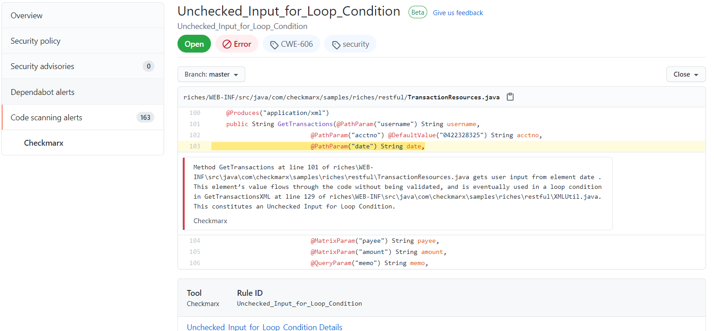

# Checkmarx CxFlow Github Action  

[](https://www.gnu.org/licenses)
[](https://github.com/checkmarx-ts/checkmarx-github-action/releases)
[](https://github.com/checkmarx-ts/checkmarx-github-action/issues)

Checkmarx CxFlow GitHub Action with SARIF output.  

Publish Security Alerts associated with the code in your Github Repository using Checkmarx with this Github Action Integration. 

This is a Wrapper to trigger scans the latest version of CxFlow through Docker to launch Checkmarx SAST or SCA Scans.


* Checkmarx SAST (**CxSAST**) is an enterprise-grade flexible and accurate static analysis solution used to identify hundreds of security vulnerabilities in custom code. It is used by development, DevOps, and security teams to scan source code early in the SDLC, identify vulnerabilities and provide actionable insights to remediate them. 
* Checkmarx SCA (**CxSCA**) is an effective next-gen software composition analysis solution designed to help development teams ship secure software quickly while giving AppSec teams the insight and control they need to improve your software security risk posture.
* Checkmarx Flow (**CxFlow**) is an SDLC orchestration module managing Applciaton Security Test (AST) scan initiation and results manangement.

Please find more info in the official website: <a href="www.checkmarx.com">Checkmarx.com</a>

## Version Compatiblity

The GitHub action  [](https://github.com/checkmarx-ts/checkmarx-github-action/releases)  is only compatible with Checkmarx SAST 9.x and Checkmarx CxSCA.

## Inputs

| Variable  | Example Value &nbsp;| Description &nbsp; | Type | Required | Default |
| ------------- | ------------- | ------------- |------------- | ------------- | ------------- |
| checkmarx_url | https://checkmarx.company.com | Checkmarx Server URL | String | Yes | N/A
| checkmarx_username | ${{ secrets.CHECKMARX_USERNAME }} | Checkmarx Username | String | Yes | N/A
| checkmarx_password | ${{ secrets.CHECKMARX_PASSWORD }} | Checkmarx Password | Secure String | Yes | N/A
| checkmarx_client_secret | ${{ secrets.CHECKMARX_CLIENT_SECRET }} | Checkmarx OIDC Client Secret  Reference [1](https://checkmarx.atlassian.net/wiki/spaces/KC/pages/1187774721/Using+the+CxSAST+REST+API+v8.6.0+and+up), [2](https://checkmarx.atlassian.net/wiki/spaces/KC/pages/1187774721/Using+the+CxSAST+REST+API+v8.6.0+and+up) | Secure String | Yes |
| team | /CxServer/SP/Company | Checkmarx Team for Project | String | No | /CxServer/SP/Company |
| project | ProjectName | Checkmarx Project | String | Yes | N/A |
| app | AppID-1234 | Unique Application Identifier used by downstream bug trackers (i.e. Jira) | String | No | SampleApp |
| preset | Checkmarx Express | Checkmarx scan preset (SAST) | String | No | High and Medium |
| break_build | true | Break build based on results? | Boolean | No | false |
| bug_tracker | Sarif, GitHubPull, GitHub | Bug-tracker used for scan results | String | No | Sarif |
| incremental | true | Trigger scan as incremental? (SAST) | Boolean | No | true |
| github_token | ${{ secrets.GITHUB_TOKEN }} | GitHub API Token, used for PR Feedback or GitHub Issue Feedback | String | No | ${{ github.token }} |
| scanners | sast, cxgo, sca | Vulnerability Scanners (sast, sca, cxgo). Multiple comma seperated values allowed. | String | Yes | None |
| sca_api_url | https://api.scacheckmarx.com | API URL for SCA scan | String | No | https://api.scacheckmarx.com  |
| sca_app_url | https://sca.scacheckmarx.com | APP URL for SCA scan | String | No | https://sca.scacheckmarx.com |
| sca_access_control_url | https://platform.checkmarx.net | Access control URL for SCA scan | String | No | https://platform.checkmarx.net |
| sca_tenant | SCA-COMPANY_NAME | Tenant for the SCA project | String | No | N/A |
| sca_username | ${{ secrets.SCA_USERNAME }} | Username for SCA scan | String | No | N/A |
| sca_password | ${{ secrets.SCA_PASSWORD }} | Password for SCA scan | Secure String | No | N/A |
| cxgo_base_url | https://api.checkmarx.net | Base URL for CxGo Scan | String | No | https://api.checkmarx.net |
| cxgo_portal_url | https://cloud.checkmarx.net | Portal URL for CxGo Scan | String | No | https://cloud.checkmarx.net |
| cxgo_client_secret | ${{ secrets.CXGO_CLIENT_SECRET }} | CxGo Client secret | Secure String | No | N/A |
| params | --severity=High --branch=${{ github.ref }}| Any additional parameters for CxFlow.  For a full list of all the parameters, see the [following](https://github.com/checkmarx-ltd/cx-flow/wiki/Configuration).  Special note about [filtering](#Filters) | String | No | |

## Secrets

_Note: It is recommentded to leverage secrets for any sensitive inputs_
* checkmarx_url: ${{ secrets.CHECKMARX_URL }}
* checkmarx_username: ${{ secrets.CHECKMARX_USERNAME }}
* checkmarx_password: ${{ secrets.CHECKMARX_PASSWORD }}
* checkmarx_client_secret: ${{ secrets.CHECKMARX_CLIENT_SECRET }}
* github_token: ${{ secrets.GITHUB_TOKEN }}
* sca_username: ${{ secrets.SCA_USERNAME }}
* sca_password: ${{ secrets.SCA_PASSWORD }}
* cxgo_client_secret: ${{ secrets.CXGO_CLIENT_SECRET }}

## Filters

_Note: For filtering files in the params input, it is necessary to escape special characters_

Here is an example of filtering files:

--cx-flow.zip-exclude="\\.git\\/.\*,\\.github\\/.\*,apps\\/tests\\/.\*,apps\\/docs\/.\*,apps\\/web\\/.\*"

## Outputs

The default output format for this GitHub Action is a [SARIF](https://docs.github.com/en/github/finding-security-vulnerabilities-and-errors-in-your-code/sarif-support-for-code-scanning) output report stored in the working directory as **./cx.sarif**

For full documentation on all the supported output formats and defect management integration, please see the [following](https://github.com/checkmarx-ltd/cx-flow/wiki/Bug-Trackers-and-Feedback-Channels).  

### `SARIF Report`

The file **_./cx.sarif_** is created containing issue details based on the filtering policy of CxFlow.  To make use of the report for CodeQL please make sure the [following is considered](https://docs.github.com/en/github/finding-security-vulnerabilities-and-errors-in-your-code/uploading-a-sarif-file-to-github).  See sample useage below.

## Example usage

```
    # Steps represent a sequence of tasks that will be executed as part of the job
    steps:
    # Checks-out your repository under $GITHUB_WORKSPACE, so your job can access it
    - uses: actions/checkout@v2
    # Scan code with Checkmarx
    - name: Checkmarx CxFlow Action
      uses: checkmarx-ts/checkmarx-cxflow-github-action@v1.3
      with:
        project: GithubActionTest
        team: /CxServer/SP/Checkmarx
        checkmarx_url: ${{ secrets.CHECKMARX_URL }}
        checkmarx_username: ${{ secrets.CHECKMARX_USERNAME }}
        checkmarx_password: ${{ secrets.CHECKMARX_PASSWORD }}
        checkmarx_client_secret: ${{ secrets.CHECKMARX_CLIENT_SECRET }}
    # Upload SARIF report for CodeQL / Security Alerts PRocessing
    - name: Upload SARIF file
      uses: github/codeql-action/upload-sarif@v1
      with:
        sarif_file: cx.sarif
```

## Sample Output (Security Alerts)



## Sample Workflow files

 * [Github PUSH workflow for SAST](sample-yml/checkmarx-sast-scan-push.yml)
 * [Github PUSH workflow for SCA](sample-yml/checkmarx-sca-scan-push.yml)
 * [Github PULL REQUEST workflow for SAST](sample-yml/github-pullrequest.yml)
 

## How To Contribute

We welcome [issues](https://github.com/checkmarx-ts/checkmarx-cxflow-github-action/issues) to and [pull requests](https://github.com/checkmarx-ts/checkmarx-cxflow-github-action/pulls) against this repository!

# License

Checkmarx Github Action

Copyright (C) 2020 Checkmarx

This program is free software: you can redistribute it and/or modify it under the terms of the GNU General Public License as published by the Free Software Foundation, either version 3 of the License, or (at your option) any later version.

This program is distributed in the hope that it will be useful, but WITHOUT ANY WARRANTY; without even the implied warranty of MERCHANTABILITY or FITNESS FOR A PARTICULAR PURPOSE. See the GNU General Public License for more details.

You should have received a copy of the GNU General Public License along with this program. If not, see https://www.gnu.org/licenses/.
